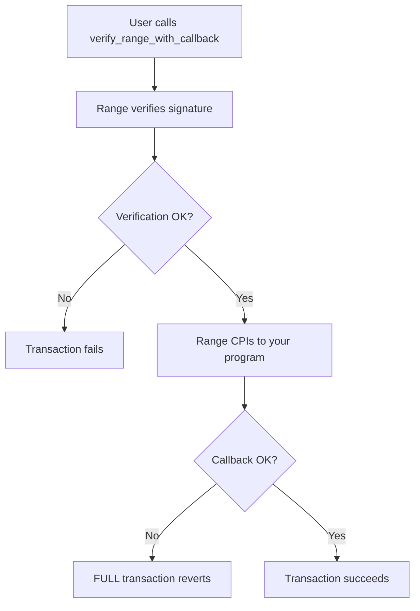

import { Steps, Aside } from '@astrojs/starlight/components';

The `verify_range_with_callback` instruction verifies a signature and then calls your program via CPI. This pattern ensures atomicity - if your callback fails, the entire transaction (including verification) reverts.

## When to Use Callbacks

Use callbacks when you need:

- **Atomic operations**: Verification and action must both succeed or both fail
- **Gated functionality**: Only verified users can perform certain actions
- **State updates after verification**: Mark users as verified, update counts, etc.



<Aside type="caution">
If the callback fails, verification is also rolled back. You cannot have a "partially verified" state.
</Aside>

## Implementation Steps

<Steps>

1. **Create on_verify Instruction**

   Your program needs an `on_verify` instruction that Range will call:

   ```rust
   use anchor_lang::prelude::*;

   #[derive(Accounts)]
   pub struct OnVerify<'info> {
       pub signer: Signer<'info>,

       /// CHECK: Instructions sysvar for CPI verification
       #[account(address = anchor_lang::solana_program::sysvar::instructions::ID)]
       pub instructions_sysvar: AccountInfo<'info>,

       // Your custom accounts
       #[account(mut)]
       pub user_account: Account<'info, UserAccount>,
   }

   pub fn on_verify(ctx: Context<OnVerify>, cpi_data: Vec<u8>) -> Result<()> {
       // 1. CRITICAL: Verify caller is Range
       verify_range_caller(&ctx.accounts.instructions_sysvar)?;

       // 2. Process your callback logic
       let user_account = &mut ctx.accounts.user_account;
       user_account.verified = true;
       user_account.last_verified_at = Clock::get()?.unix_timestamp;

       msg!("User verified successfully");
       Ok(())
   }
   ```

2. **Implement CPI Verification**

   ```rust
   use anchor_lang::solana_program::sysvar::instructions::{
       get_instruction_relative,
       load_current_index_checked,
   };

   const RANGE_PROGRAM_ID: Pubkey = pubkey!("YourRangeProgramId...");

   fn verify_range_caller(ix_sysvar: &AccountInfo) -> Result<()> {
       let current_index = load_current_index_checked(ix_sysvar)
           .map_err(|_| YourError::InvalidInstructionSysvar)?;

       // Must not be the first instruction (we need a caller)
       require!(current_index > 0, YourError::CpiOnly);

       // Get the instruction that called us
       let calling_ix = get_instruction_relative(-1, ix_sysvar)
           .map_err(|_| YourError::InvalidInstructionSysvar)?;

       // Verify it's from Range
       require!(
           calling_ix.program_id == RANGE_PROGRAM_ID,
           YourError::CpiOnly
       );

       Ok(())
   }
   ```

3. **Call from Client**

   ```typescript
   import { buildVerifyRangeWithCallbackInstruction } from './codama-ts-range-custom';

   const instruction = await buildVerifyRangeWithCallbackInstruction({
     signer: userPublicKey,
     admin: settingsAdminPublicKey,
     targetProgram: yourProgramId,
     signature: signatureBytes,
     message: messageBytes,
     cpiData: new Uint8Array([/* your custom data */]),
     remainingAccounts: [
       { pubkey: userPublicKey, isSigner: true, isWritable: false },
       { pubkey: SYSVAR_INSTRUCTIONS_PUBKEY, isSigner: false, isWritable: false },
       { pubkey: userAccountPda, isSigner: false, isWritable: true },
     ],
   });
   ```

</Steps>

## Understanding cpi_data

The `cpi_data` parameter lets you pass arbitrary data to your callback:

### Simple Action Flag

```typescript
// Client
const cpiData = new Uint8Array([1]); // 1 = action A, 2 = action B
```

```rust
// On-chain
pub fn on_verify(ctx: Context<OnVerify>, cpi_data: Vec<u8>) -> Result<()> {
    let action = cpi_data.get(0).ok_or(YourError::InvalidCpiData)?;

    match action {
        1 => perform_action_a(ctx)?,
        2 => perform_action_b(ctx)?,
        _ => return Err(YourError::UnknownAction.into()),
    }

    Ok(())
}
```

### Structured Data (Borsh)

```typescript
// Client
import * as borsh from 'borsh';

class CallbackParams {
  amount: bigint;
  recipient: Uint8Array;

  constructor(fields: { amount: bigint; recipient: Uint8Array }) {
    this.amount = fields.amount;
    this.recipient = fields.recipient;
  }
}

const schema = new Map([
  [CallbackParams, { kind: 'struct', fields: [
    ['amount', 'u64'],
    ['recipient', [32]],
  ]}],
]);

const params = new CallbackParams({
  amount: BigInt(1000),
  recipient: recipientPubkey.toBytes(),
});

const cpiData = borsh.serialize(schema, params);
```

```rust
// On-chain
#[derive(BorshDeserialize)]
pub struct CallbackParams {
    pub amount: u64,
    pub recipient: Pubkey,
}

pub fn on_verify(ctx: Context<OnVerify>, cpi_data: Vec<u8>) -> Result<()> {
    let params: CallbackParams = CallbackParams::try_from_slice(&cpi_data)
        .map_err(|_| YourError::InvalidCpiData)?;

    // Use params.amount, params.recipient
    Ok(())
}
```

## remaining_accounts Pattern

Pass additional accounts through `remaining_accounts`:

```typescript
// Client
remainingAccounts: [
  // Index 0: signer (usually required)
  { pubkey: userPublicKey, isSigner: true, isWritable: false },
  // Index 1: instructions sysvar (for CPI verification)
  { pubkey: SYSVAR_INSTRUCTIONS_PUBKEY, isSigner: false, isWritable: false },
  // Index 2+: your accounts
  { pubkey: userTokenAccount, isSigner: false, isWritable: true },
  { pubkey: treasuryTokenAccount, isSigner: false, isWritable: true },
  { pubkey: TOKEN_PROGRAM_ID, isSigner: false, isWritable: false },
],
```

```rust
// On-chain - access by index
pub fn on_verify(ctx: Context<OnVerify>, cpi_data: Vec<u8>) -> Result<()> {
    verify_range_caller(&ctx.accounts.instructions_sysvar)?;

    let remaining = &ctx.remaining_accounts;

    // Index based access
    let user_token = &remaining[2];
    let treasury_token = &remaining[3];
    let token_program = &remaining[4];

    // Transfer tokens
    let transfer_accounts = Transfer {
        from: user_token.to_account_info(),
        to: treasury_token.to_account_info(),
        authority: ctx.accounts.signer.to_account_info(),
    };

    token::transfer(
        CpiContext::new(token_program.to_account_info(), transfer_accounts),
        amount
    )?;

    Ok(())
}
```

<Aside type="tip">
Document your expected `remaining_accounts` order clearly. Consider using constants for indices.
</Aside>

## Error Handling

### Callback Errors Revert Everything

```rust
pub fn on_verify(ctx: Context<OnVerify>, cpi_data: Vec<u8>) -> Result<()> {
    verify_range_caller(&ctx.accounts.instructions_sysvar)?;

    // If this fails, the ENTIRE transaction reverts
    // including the Range verification
    require!(
        ctx.accounts.user_account.balance >= 100,
        YourError::InsufficientBalance
    );

    // This won't execute if above check fails
    do_something()?;

    Ok(())
}
```

### Custom Error Types

```rust
#[error_code]
pub enum YourError {
    #[msg("This instruction can only be called via CPI from Range")]
    CpiOnly,

    #[msg("Invalid instruction sysvar")]
    InvalidInstructionSysvar,

    #[msg("Invalid cpi_data format")]
    InvalidCpiData,

    #[msg("Unknown action")]
    UnknownAction,

    #[msg("Insufficient balance for operation")]
    InsufficientBalance,
}
```

## Complete Example: Verified Token Transfer

```rust
use anchor_lang::prelude::*;
use anchor_spl::token::{self, Token, TokenAccount, Transfer};

#[program]
pub mod verified_transfer {
    use super::*;

    pub fn on_verify(ctx: Context<OnVerify>, cpi_data: Vec<u8>) -> Result<()> {
        // 1. Verify CPI caller
        verify_range_caller(&ctx.accounts.instructions_sysvar)?;

        // 2. Parse transfer params
        let params: TransferParams = TransferParams::try_from_slice(&cpi_data)
            .map_err(|_| ErrorCode::InvalidCpiData)?;

        // 3. Verify user has sufficient balance
        require!(
            ctx.accounts.from_token.amount >= params.amount,
            ErrorCode::InsufficientBalance
        );

        // 4. Execute transfer
        let transfer_accounts = Transfer {
            from: ctx.accounts.from_token.to_account_info(),
            to: ctx.accounts.to_token.to_account_info(),
            authority: ctx.accounts.signer.to_account_info(),
        };

        token::transfer(
            CpiContext::new(
                ctx.accounts.token_program.to_account_info(),
                transfer_accounts
            ),
            params.amount
        )?;

        msg!("Verified transfer of {} tokens complete", params.amount);
        Ok(())
    }
}

#[derive(Accounts)]
pub struct OnVerify<'info> {
    pub signer: Signer<'info>,

    /// CHECK: Instructions sysvar
    #[account(address = anchor_lang::solana_program::sysvar::instructions::ID)]
    pub instructions_sysvar: AccountInfo<'info>,

    #[account(mut, constraint = from_token.owner == signer.key())]
    pub from_token: Account<'info, TokenAccount>,

    #[account(mut)]
    pub to_token: Account<'info, TokenAccount>,

    pub token_program: Program<'info, Token>,
}
```

## See Also

- [verify_range_with_callback](/reference/instructions/verify-range-with-callback) - Instruction reference
- [on_verify](/reference/cpi-program/on-verify) - Callback instruction reference
- [Build CPI Program](/guides/build-cpi-program) - Full integration guide
