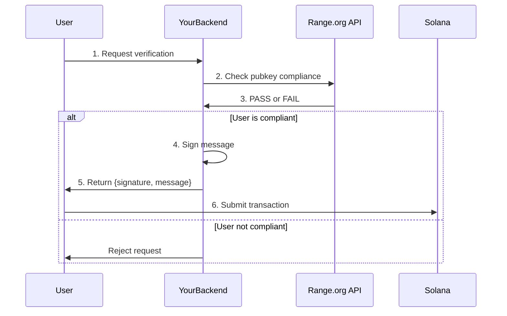

import { Steps, Aside } from '@astrojs/starlight/components';

Range is designed to work with compliance services like [Range.org](https://range.org) to verify user eligibility before signing verification messages. This guide covers the integration pattern.

## Overview

The compliance flow ensures that only verified users receive signed messages:



## Range.org Integration

Range.org provides compliance checks for Solana addresses, including:

- Sanctions screening
- KYC verification status
- Geographic restrictions
- Risk scoring

### Backend Setup

<Steps>

1. **Get Range.org API Credentials**

   Sign up at [Range.org](https://range.org) to obtain API credentials.

2. **Install SDK**

   ```bash
   npm install @range-org/sdk
   ```

3. **Configure Client**

   ```typescript
   import { RangeClient } from '@range-org/sdk';

   const rangeOrg = new RangeClient({
     apiKey: process.env.RANGE_ORG_API_KEY,
     environment: 'production', // or 'sandbox' for testing
   });
   ```

</Steps>

## Verification Endpoint

Create an endpoint that checks compliance before signing:

```typescript
import express from 'express';
import nacl from 'tweetnacl';
import { RangeClient } from '@range-org/sdk';
import { Keypair, PublicKey } from '@solana/web3.js';

const app = express();
const rangeOrg = new RangeClient({ apiKey: process.env.RANGE_ORG_API_KEY });

// Load your range_signer keypair (keep this secure!)
const rangeSignerKeypair = Keypair.fromSecretKey(
  Buffer.from(process.env.RANGE_SIGNER_SECRET_KEY, 'base64')
);

app.post('/api/verify', async (req, res) => {
  try {
    const { pubkey, authSignature, authMessage } = req.body;

    // 1. Verify the auth signature (proves wallet ownership)
    const isValidAuth = verifyWalletOwnership(pubkey, authSignature, authMessage);
    if (!isValidAuth) {
      return res.status(401).json({ error: 'Invalid authentication' });
    }

    // 2. Check compliance with Range.org
    const complianceResult = await rangeOrg.checkAddress(pubkey);

    if (!complianceResult.isCompliant) {
      return res.status(403).json({
        error: 'Compliance check failed',
        reason: complianceResult.reason,
      });
    }

    // 3. Create and sign the verification message
    const timestamp = Math.floor(Date.now() / 1000);
    const message = `${timestamp}_${pubkey}`;
    const messageBytes = Buffer.from(message);

    const signature = nacl.sign.detached(
      messageBytes,
      rangeSignerKeypair.secretKey
    );

    // 4. Return to user
    res.json({
      signature: Buffer.from(signature).toString('base64'),
      message: message,
      expiresAt: timestamp + 60, // Based on your window_size
    });

  } catch (error) {
    console.error('Verification error:', error);
    res.status(500).json({ error: 'Internal server error' });
  }
});

function verifyWalletOwnership(
  pubkey: string,
  signature: string,
  message: string
): boolean {
  try {
    const publicKey = new PublicKey(pubkey);
    const signatureBytes = Buffer.from(signature, 'base64');
    const messageBytes = Buffer.from(message);

    return nacl.sign.detached.verify(
      messageBytes,
      signatureBytes,
      publicKey.toBytes()
    );
  } catch {
    return false;
  }
}
```

<Aside type="caution">
Keep your `range_signer` keypair secure. It should only exist on your backend servers and never be exposed to clients.
</Aside>

## Client-Side Integration

### Request Verification

```typescript
import { useWallet } from '@solana/wallet-adapter-react';

async function requestVerification() {
  const { publicKey, signMessage } = useWallet();

  // 1. Sign auth message to prove wallet ownership
  const authMessage = `Authenticate for Range verification: ${Date.now()}`;
  const authSignature = await signMessage(new TextEncoder().encode(authMessage));

  // 2. Request signed verification from backend
  const response = await fetch('/api/verify', {
    method: 'POST',
    headers: { 'Content-Type': 'application/json' },
    body: JSON.stringify({
      pubkey: publicKey.toBase58(),
      authSignature: Buffer.from(authSignature).toString('base64'),
      authMessage,
    }),
  });

  if (!response.ok) {
    const error = await response.json();
    throw new Error(error.error);
  }

  const { signature, message } = await response.json();

  return {
    signature: Buffer.from(signature, 'base64'),
    message: Buffer.from(message),
  };
}
```

### Submit Verification Transaction

```typescript
import { buildVerifyRangeInstruction } from './codama-ts-range-custom';

async function verifyOnChain() {
  const { publicKey, sendTransaction } = useWallet();

  // Get signed message from backend
  const { signature, message } = await requestVerification();

  // Build and send transaction
  const instruction = await buildVerifyRangeInstruction({
    signer: publicKey,
    admin: SETTINGS_ADMIN_PUBKEY,
    signature: new Uint8Array(signature),
    message: new Uint8Array(message),
  });

  const transaction = new Transaction().add(instruction);
  const txSignature = await sendTransaction(transaction, connection);

  console.log('Verified:', txSignature);
}
```

## Compliance Caching

To reduce API calls to Range.org, implement caching:

```typescript
import NodeCache from 'node-cache';

const complianceCache = new NodeCache({
  stdTTL: 3600, // Cache for 1 hour
  checkperiod: 600,
});

async function checkCompliance(pubkey: string): Promise<boolean> {
  // Check cache first
  const cached = complianceCache.get<boolean>(pubkey);
  if (cached !== undefined) {
    return cached;
  }

  // Query Range.org
  const result = await rangeOrg.checkAddress(pubkey);
  const isCompliant = result.isCompliant;

  // Cache result
  complianceCache.set(pubkey, isCompliant);

  return isCompliant;
}
```

<Aside type="tip">
Range.org compliance data doesn't change frequently. Caching for 1 hour is typically safe and significantly reduces API costs.
</Aside>

## Error Handling

Handle common compliance scenarios:

```typescript
app.post('/api/verify', async (req, res) => {
  try {
    const result = await rangeOrg.checkAddress(pubkey);

    switch (result.status) {
      case 'PASS':
        // User is compliant, sign message
        break;

      case 'FAIL_SANCTIONS':
        return res.status(403).json({
          error: 'Address is on sanctions list',
          code: 'SANCTIONS',
        });

      case 'FAIL_KYC':
        return res.status(403).json({
          error: 'KYC verification required',
          code: 'KYC_REQUIRED',
          kycUrl: result.kycUrl, // Link to complete KYC
        });

      case 'FAIL_GEOGRAPHY':
        return res.status(403).json({
          error: 'Service not available in your region',
          code: 'GEO_BLOCKED',
        });

      default:
        return res.status(403).json({
          error: 'Compliance check failed',
          code: 'UNKNOWN',
        });
    }
  } catch (error) {
    // Handle Range.org API errors
    if (error.code === 'RATE_LIMITED') {
      return res.status(429).json({ error: 'Too many requests' });
    }
    throw error;
  }
});
```

## Without Range.org

You can use Range without Range.org by implementing your own compliance logic:

```typescript
async function checkComplianceCustom(pubkey: string): Promise<boolean> {
  // Your custom compliance checks
  const isInAllowlist = await checkAllowlist(pubkey);
  const passedKYC = await checkKYCStatus(pubkey);
  const notSanctioned = await checkSanctionsList(pubkey);

  return isInAllowlist && passedKYC && notSanctioned;
}
```

## See Also

- [Range.org Documentation](https://docs.range.org)
- [Architecture](/reference/architecture) - Full verification flow
- [Security](/security) - Security best practices
