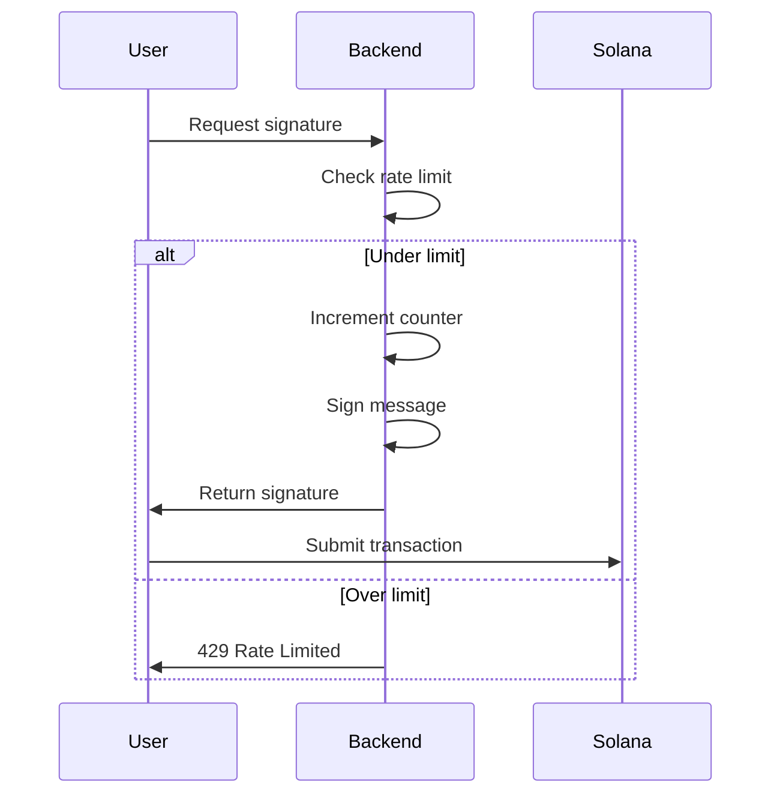

import { Aside } from '@astrojs/starlight/components';

Range's signature-based architecture enables powerful rate limiting patterns. Since users need backend signatures to verify on-chain, your backend controls who can perform actions and how often.

## The Pattern



The key insight: **Rate limiting happens off-chain**, but the on-chain action is still cryptographically verified.

## Simple Rate Limiting

Basic per-user rate limiting:

```typescript
import NodeCache from 'node-cache';

const rateLimitCache = new NodeCache({ stdTTL: 60 }); // 60 second window

interface RateLimitConfig {
  maxRequests: number;
  windowSeconds: number;
}

function checkRateLimit(
  pubkey: string,
  config: RateLimitConfig = { maxRequests: 10, windowSeconds: 60 }
): boolean {
  const key = `ratelimit:${pubkey}`;
  const current = rateLimitCache.get<number>(key) || 0;

  if (current >= config.maxRequests) {
    return false; // Rate limited
  }

  rateLimitCache.set(key, current + 1, config.windowSeconds);
  return true;
}

// In your endpoint
app.post('/api/verify', async (req, res) => {
  const { pubkey } = req.body;

  if (!checkRateLimit(pubkey)) {
    return res.status(429).json({
      error: 'Rate limited',
      retryAfter: 60,
    });
  }

  // Continue with compliance check and signing...
});
```

## Tiered Rate Limiting

Different limits based on user tier:

```typescript
interface UserTier {
  name: string;
  maxRequests: number;
  windowSeconds: number;
}

const tiers: Record<string, UserTier> = {
  free: { name: 'Free', maxRequests: 10, windowSeconds: 60 },
  basic: { name: 'Basic', maxRequests: 50, windowSeconds: 60 },
  premium: { name: 'Premium', maxRequests: 200, windowSeconds: 60 },
  unlimited: { name: 'Unlimited', maxRequests: Infinity, windowSeconds: 60 },
};

async function getUserTier(pubkey: string): Promise<UserTier> {
  // Check database, NFT ownership, token balance, etc.
  const user = await db.users.findOne({ pubkey });

  if (!user) return tiers.free;

  // Check for premium NFT
  const hasNFT = await checkNFTOwnership(pubkey, PREMIUM_NFT_COLLECTION);
  if (hasNFT) return tiers.premium;

  // Check token balance
  const balance = await getTokenBalance(pubkey, YOUR_TOKEN_MINT);
  if (balance >= 1000) return tiers.basic;

  return tiers.free;
}

app.post('/api/verify', async (req, res) => {
  const { pubkey } = req.body;

  const tier = await getUserTier(pubkey);

  if (!checkRateLimit(pubkey, tier)) {
    return res.status(429).json({
      error: 'Rate limited',
      tier: tier.name,
      limit: tier.maxRequests,
      window: tier.windowSeconds,
    });
  }

  // Continue...
});
```

## Sliding Window Rate Limiting

More accurate rate limiting with sliding windows using Redis:

```typescript
import Redis from 'ioredis';

const redis = new Redis(process.env.REDIS_URL);

async function checkSlidingWindowLimit(
  pubkey: string,
  maxRequests: number,
  windowMs: number
): Promise<{ allowed: boolean; remaining: number; resetAt: number }> {
  const now = Date.now();
  const windowStart = now - windowMs;
  const key = `ratelimit:sliding:${pubkey}`;

  // Use Redis transaction
  const multi = redis.multi();
  multi.zremrangebyscore(key, 0, windowStart);
  multi.zcard(key);
  multi.zadd(key, now.toString(), now.toString());
  multi.pexpire(key, windowMs);

  const results = await multi.exec();
  const count = results?.[1]?.[1] as number || 0;

  if (count >= maxRequests) {
    await redis.zrem(key, now.toString());
    return {
      allowed: false,
      remaining: 0,
      resetAt: now + windowMs,
    };
  }

  return {
    allowed: true,
    remaining: maxRequests - count - 1,
    resetAt: now + windowMs,
  };
}
```

## Action-Specific Limits

Different limits for different actions:

```typescript
interface ActionLimit {
  maxRequests: number;
  windowSeconds: number;
}

const actionLimits: Record<string, ActionLimit> = {
  verify: { maxRequests: 100, windowSeconds: 60 },
  transfer: { maxRequests: 10, windowSeconds: 60 },
  withdraw: { maxRequests: 5, windowSeconds: 300 },
};

app.post('/api/verify', async (req, res) => {
  const { pubkey, action } = req.body;

  const limits = actionLimits[action] || actionLimits.verify;
  const key = `${pubkey}:${action}`;

  if (!checkRateLimit(key, limits)) {
    return res.status(429).json({
      error: `Rate limited for ${action}`,
      limit: limits.maxRequests,
      window: limits.windowSeconds,
    });
  }

  // Sign message with action included
  const message = `${timestamp}_${pubkey}_${action}`;
  // ...
});
```

<Aside type="tip">
Include the action in the signed message if you want to enforce action-specific verification on-chain. See [Custom Messages](/guides/custom-messages).
</Aside>

## Rate Limit Headers

Return rate limit info in response headers:

```typescript
app.post('/api/verify', async (req, res) => {
  const { pubkey } = req.body;

  const result = await checkSlidingWindowLimit(pubkey, 100, 60000);

  res.set({
    'X-RateLimit-Limit': '100',
    'X-RateLimit-Remaining': result.remaining.toString(),
    'X-RateLimit-Reset': Math.ceil(result.resetAt / 1000).toString(),
  });

  if (!result.allowed) {
    res.set('Retry-After', Math.ceil((result.resetAt - Date.now()) / 1000).toString());
    return res.status(429).json({ error: 'Rate limited' });
  }

  // Continue with signing...
});
```

## Client-Side Handling

Handle rate limits gracefully:

```typescript
async function requestWithRetry(
  pubkey: string,
  maxRetries: number = 3
): Promise<{ signature: Uint8Array; message: Uint8Array }> {
  for (let i = 0; i < maxRetries; i++) {
    const response = await fetch('/api/verify', {
      method: 'POST',
      body: JSON.stringify({ pubkey }),
    });

    if (response.status === 429) {
      const retryAfter = response.headers.get('Retry-After');
      const waitMs = retryAfter ? parseInt(retryAfter) * 1000 : 5000;

      console.log(`Rate limited, waiting ${waitMs}ms...`);
      await new Promise(resolve => setTimeout(resolve, waitMs));
      continue;
    }

    if (!response.ok) {
      throw new Error(`Request failed: ${response.status}`);
    }

    return response.json();
  }

  throw new Error('Max retries exceeded');
}
```

## See Also

- [Custom Messages](/guides/custom-messages) - Include action in signed message
- [KYC/Compliance](/guides/kyc-compliance) - Combine with compliance checks
- [Security](/security) - Security best practices
