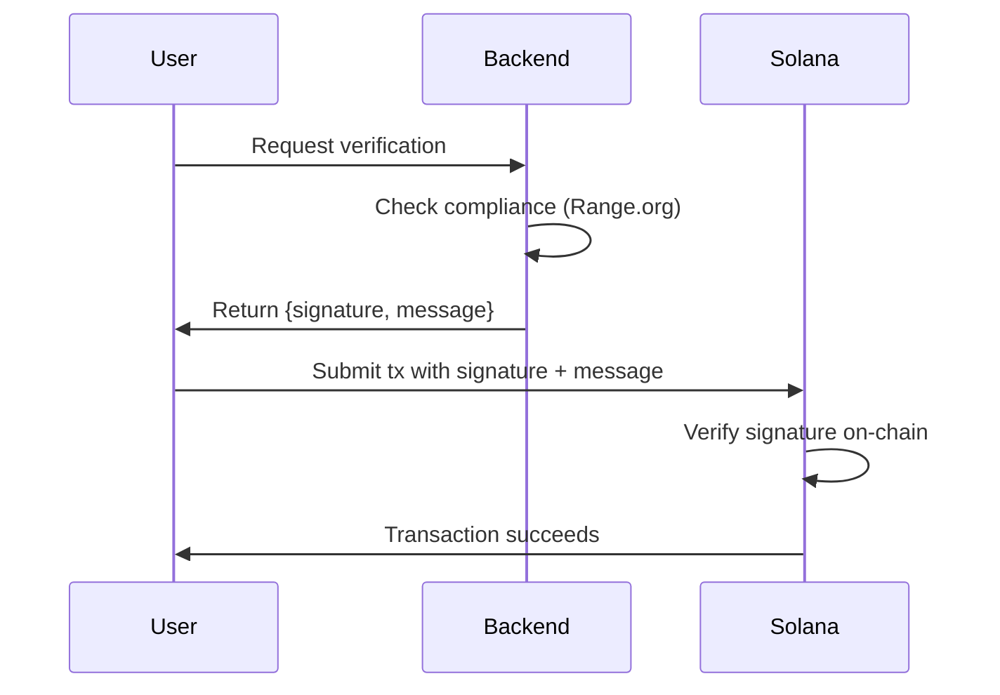

import { Card, CardGrid } from '@astrojs/starlight/components';
import LinkCard from '../../components/LinkCard.astro';

Range enables on-chain verification of backend-signed messages without requiring transaction co-signers.

## The Problem

Traditional on-chain verification requires backends to co-sign every transaction:

- Backend service must be online for every user transaction
- Increased complexity in transaction construction
- Security risks if backend signs malicious transactions
- Tight coupling between frontend and backend systems

## The Solution

Range decouples verification from transaction signing. Instead of co-signing transactions, your backend signs a **message** containing verification data. Users include this signed message in their transaction, and the on-chain program verifies it.

## Key Features

<CardGrid>
  <Card title="No Co-signing Required" icon="rocket">
    Backend signs messages offline. Users submit transactions independently.
  </Card>
  <Card title="Time-bound Signatures" icon="seti:clock">
    Configurable time windows prevent replay attacks.
  </Card>
  <Card title="Multi-tenant" icon="group">
    Each admin creates their own Settings PDA with custom configuration.
  </Card>
  <Card title="CPI Support" icon="puzzle">
    Call Range from other programs or trigger callbacks after verification.
  </Card>
</CardGrid>

## Security Properties

| Property | How It's Achieved |
|----------|-------------------|
| **Authenticity** | Only the backend (holding `range_signer` private key) can create valid signatures |
| **Integrity** | Any modification to the message invalidates the Ed25519 signature |
| **Freshness** | Time window validation prevents replay attacks |
| **Binding** | Pubkey in message must match the transaction signer |

## Next Steps

<CardGrid>
  <LinkCard title="Quick Start" href="/quick-start" icon="rocket">
    Verify your first signature in 5 minutes
  </LinkCard>
  <LinkCard title="Architecture" href="/reference/architecture" icon="puzzle">
    Understand the verification flow and state machines
  </LinkCard>
  <LinkCard title="Instructions Reference" href="/reference/instructions/verify-range" icon="document">
    Detailed API documentation for all instructions
  </LinkCard>
</CardGrid>
