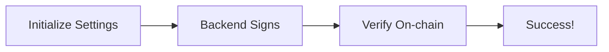

import { Steps, Aside } from '@astrojs/starlight/components';

This guide walks you through verifying a backend-signed message on-chain. By the end, you'll understand the core Range verification flow.

## Prerequisites

- [Solana CLI](https://docs.solana.com/cli/install-solana-cli-tools) installed
- [Anchor](https://www.anchor-lang.com/docs/installation) installed
- Node.js 18+
- A Solana wallet with devnet SOL

## Overview

The verification flow has three steps:

1. **Initialize Settings** - Create a Settings PDA with your trusted signer's public key
2. **Backend Signs Message** - Your backend creates `{timestamp}_{pubkey}` and signs it
3. **Verify On-chain** - User submits transaction with the signature and message



## Step-by-Step

<Steps>

1. **Clone and Build the Range Program**

   ```bash
   git clone https://github.com/ZKLSOL/range.git
   cd range
   anchor build
   ```

2. **Generate TypeScript Client**

   Range uses [Codama](https://github.com/codama-idl/codama) to generate type-safe clients from the IDL.

   ```bash
   # Install dependencies
   yarn install

   # The client is pre-generated in codama-ts-range/
   # To regenerate after IDL changes:
   yarn codama
   ```

3. **Initialize Settings**

   Create a Settings account that stores your trusted signer's public key:

   ```typescript
   import { Connection, Keypair } from '@solana/web3.js';
   import { buildInitializeSettingsInstruction } from './codama-ts-range-custom';

   const connection = new Connection('https://api.devnet.solana.com');
   const admin = Keypair.generate(); // Your admin keypair
   const rangeSigner = Keypair.generate(); // Backend's signing keypair

   const instruction = await buildInitializeSettingsInstruction({
     admin: admin.publicKey,
     rangeSigner: rangeSigner.publicKey,
     windowSize: 60n, // 60 seconds validity window
   });

   // Sign and send transaction...
   ```

   <Aside type="tip">
   The `windowSize` determines how long a signature remains valid. 60 seconds is a good default that accounts for network latency while limiting replay attack windows.
   </Aside>

4. **Backend: Sign a Message**

   Your backend creates a time-bound message and signs it:

   ```typescript
   import nacl from 'tweetnacl';

   function createSignedMessage(userPubkey: string, signerKeypair: Keypair) {
     const timestamp = Math.floor(Date.now() / 1000);
     const message = `${timestamp}_${userPubkey}`;

     const signature = nacl.sign.detached(
       Buffer.from(message),
       signerKeypair.secretKey
     );

     return {
       signature: new Uint8Array(signature),
       message: Buffer.from(message),
       timestamp,
     };
   }
   ```

   <Aside type="caution">
   The `signerKeypair` must match the `rangeSigner` stored in your Settings account. Keep this keypair secure on your backend.
   </Aside>

5. **Verify On-chain**

   The user includes the backend's signature in their transaction:

   ```typescript
   import { buildVerifyRangeInstruction } from './codama-ts-range-custom';

   // User receives signature and message from backend
   const { signature, message } = await fetchFromBackend(userPubkey);

   const instruction = await buildVerifyRangeInstruction({
     signer: userPubkey,           // Transaction signer (must match message)
     admin: settingsAdminPubkey,   // Admin who created the Settings
     signature: signature,
     message: message,
   });

   // Sign and send transaction...
   ```

   If verification succeeds, the program emits a `VerificationSuccess` event.

</Steps>

## What Gets Verified

The on-chain program performs these checks:

| Check | What It Validates | Error If Failed |
|-------|-------------------|-----------------|
| Signature | Ed25519 signature against `range_signer` | `CouldntVerifySignature` |
| Timestamp | Within `window_size` of current time | `TimestampOutOfWindow` |
| Pubkey | Message pubkey matches transaction signer | `WrongSigner` |

## Complete Example

See the [tests/range.ts](https://github.com/ZKLSOL/range/blob/main/tests/range.ts) file for a complete working example including:

- Settings initialization
- Message signing
- Verification
- Error handling

## Next Steps

- [Client Setup (Codama)](/guides/codama-setup) - Detailed guide on generating clients
- [Architecture](/reference/architecture) - Understanding the full verification flow
- [verify_range Reference](/reference/instructions/verify-range) - Complete instruction documentation
