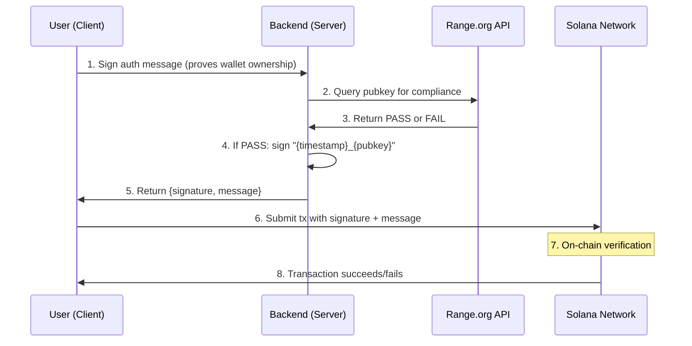
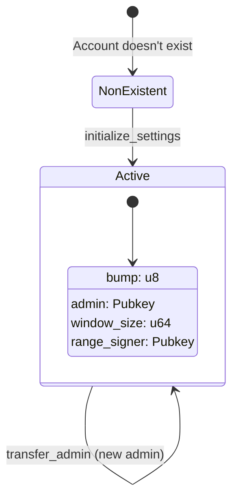
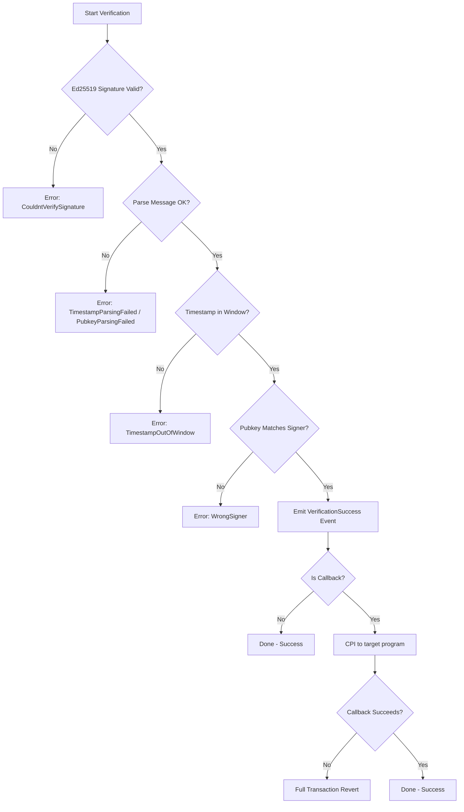
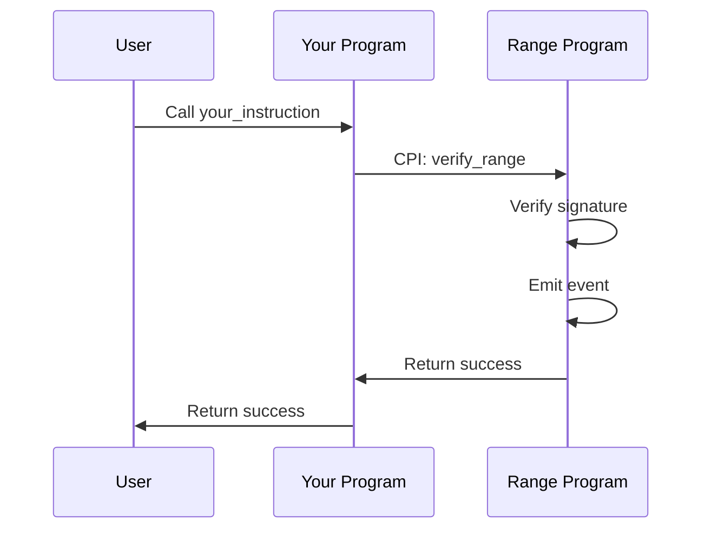
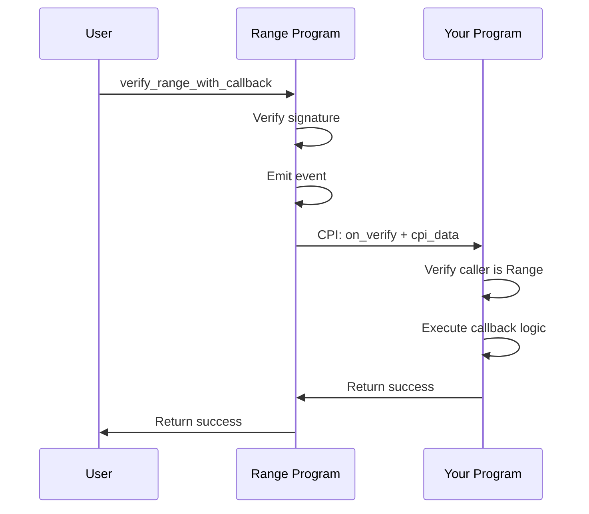
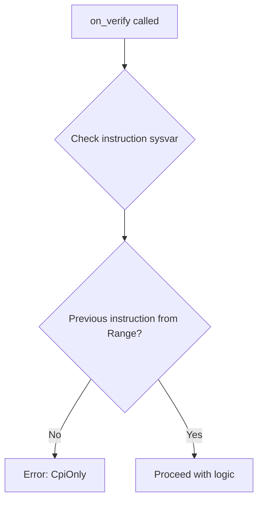

import { Aside } from '@astrojs/starlight/components';

Range is designed around a simple principle: verify backend-signed messages on-chain without requiring the backend to co-sign transactions.

## Complete Verification Flow

The full flow involves the user, backend, an optional compliance service (Range.org), and the Solana network:



### Step-by-Step

1. **User Authentication**: User signs a message with their wallet to prove ownership
2. **Compliance Check**: Backend queries Range.org (or your compliance service) to verify the pubkey
3. **Compliance Response**: Service returns PASS or FAIL
4. **Message Signing**: If compliant, backend creates and signs `{timestamp}_{pubkey}`
5. **Return to User**: Backend sends signature and message to user
6. **Transaction Submission**: User includes signature in their Solana transaction
7. **On-chain Verification**: Range program verifies signature, timestamp, and pubkey
8. **Result**: Transaction succeeds or fails with specific error

## Settings Account State Machine

Each admin can create their own Settings account. The account lifecycle:



**Key Points:**
- Any user can create their own Settings by calling `initialize_settings` as admin
- Settings PDA derived from: `["settings", admin_pubkey]`
- Only the current admin can update settings or transfer ownership
- Transferring admin changes who controls the account but keeps the same PDA

## Verification State Machine

When `verify_range` or `verify_range_with_callback` is called:



## CPI Patterns

Range supports two CPI patterns:

### Pattern A: External Program → Range

Another program calls Range for verification:



### Pattern B: Range → Callback (Atomic)

Range verifies then calls your program:



<Aside type="caution">
If the callback fails, the **entire transaction reverts** including the verification. This ensures atomicity - you can't have a "verified" state without the callback completing.
</Aside>

## CPI-Only Enforcement

The `on_verify` instruction in your program should only be callable via CPI from Range:



This is enforced by checking the instruction sysvar to verify the previous instruction was from the Range program.

## Account Structure

### Settings Account

| Field | Type | Description |
|-------|------|-------------|
| `bump` | `u8` | PDA bump seed |
| `admin` | `Pubkey` | Owner who can modify settings |
| `window_size` | `u64` | Time window in seconds for timestamp validation |
| `range_signer` | `Pubkey` | Public key of trusted backend signer |

**PDA Seeds:** `["settings", admin.key()]`

## Message Format

The standard message format is:

```
{timestamp}_{pubkey}
```

- `timestamp`: Unix timestamp (seconds) when message was signed
- `pubkey`: Base58-encoded public key of the user

Example: `1704067200_7xKXtg2CW87d97TXJSDpbD5jBkheTqA83TZRuJosgAsU`

<Aside type="tip">
The message format can be extended for additional data. See the [Custom Messages](/guides/custom-messages) guide.
</Aside>
