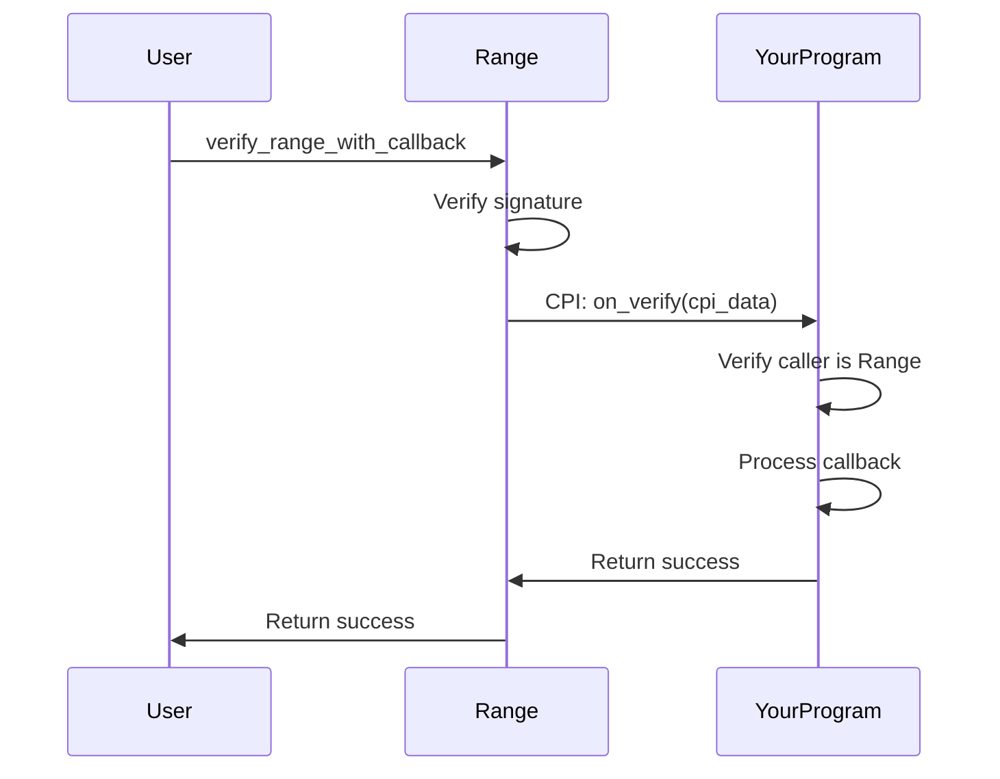

import { Aside } from '@astrojs/starlight/components';

The `on_verify` instruction is a callback that Range invokes after successful verification when using `verify_range_with_callback`. This instruction must be **CPI-only** - it should reject direct calls.

## Overview



## Signature

```rust
pub fn on_verify(
    ctx: Context<OnVerify>,
    cpi_data: Vec<u8>,
) -> Result<()>
```

## Parameters

| Parameter | Type | Description |
|-----------|------|-------------|
| `cpi_data` | `Vec<u8>` | Arbitrary data passed from the original call |

## Accounts

| Account | Type | Description |
|---------|------|-------------|
| `signer` | `Signer` | The verified user |
| `instructions_sysvar` | `AccountInfo` | For verifying CPI caller |
| Additional accounts | Via `remaining_accounts` | Your custom accounts |

## CPI-Only Enforcement

**Critical**: This instruction must only be callable via CPI from Range. Direct calls should be rejected.

```rust
use anchor_lang::solana_program::sysvar::instructions::{
    get_instruction_relative, load_current_index_checked
};

pub fn on_verify(ctx: Context<OnVerify>, cpi_data: Vec<u8>) -> Result<()> {
    // Verify this is a CPI call from Range
    let ix_sysvar = &ctx.accounts.instructions_sysvar;

    // Get the previous instruction (the one that called us via CPI)
    let current_index = load_current_index_checked(ix_sysvar)?;

    if current_index == 0 {
        // We're the first instruction - can't be a valid CPI
        return Err(YourError::CpiOnly.into());
    }

    // Get the calling instruction
    let calling_ix = get_instruction_relative(-1, ix_sysvar)?;

    // Verify it's from Range program
    require!(
        calling_ix.program_id == RANGE_PROGRAM_ID,
        YourError::CpiOnly
    );

    // Now safe to proceed with callback logic
    process_callback(cpi_data)?;

    Ok(())
}
```

<Aside type="caution">
Without CPI verification, attackers could call `on_verify` directly, bypassing Range verification entirely. This is a **critical security check**.
</Aside>

## Implementation Example

Complete callback implementation:

```rust
use anchor_lang::prelude::*;

#[derive(Accounts)]
pub struct OnVerify<'info> {
    pub signer: Signer<'info>,

    /// CHECK: Instructions sysvar for CPI verification
    #[account(address = anchor_lang::solana_program::sysvar::instructions::ID)]
    pub instructions_sysvar: AccountInfo<'info>,

    // Add your custom accounts here
    #[account(mut)]
    pub user_state: Account<'info, UserState>,
}

#[account]
pub struct UserState {
    pub verified: bool,
    pub verification_count: u64,
    pub last_verified_at: i64,
}

pub fn on_verify(ctx: Context<OnVerify>, cpi_data: Vec<u8>) -> Result<()> {
    // 1. Verify CPI caller is Range
    verify_range_cpi(&ctx.accounts.instructions_sysvar)?;

    // 2. Parse cpi_data (your custom format)
    let data: CallbackData = deserialize_callback_data(&cpi_data)?;

    // 3. Update state
    let user_state = &mut ctx.accounts.user_state;
    user_state.verified = true;
    user_state.verification_count += 1;
    user_state.last_verified_at = Clock::get()?.unix_timestamp;

    // 4. Perform action based on cpi_data
    match data.action.as_str() {
        "transfer" => {
            // Handle transfer logic
        },
        "mint" => {
            // Handle mint logic
        },
        _ => return Err(YourError::UnknownAction.into()),
    }

    msg!("Callback processed successfully");
    Ok(())
}

fn verify_range_cpi(ix_sysvar: &AccountInfo) -> Result<()> {
    use anchor_lang::solana_program::sysvar::instructions::{
        get_instruction_relative, load_current_index_checked
    };

    let current_index = load_current_index_checked(ix_sysvar)?;

    require!(current_index > 0, YourError::CpiOnly);

    let calling_ix = get_instruction_relative(-1, ix_sysvar)?;

    require!(
        calling_ix.program_id == RANGE_PROGRAM_ID,
        YourError::CpiOnly
    );

    Ok(())
}
```

## cpi_data Format

The `cpi_data` parameter is arbitrary bytes that you define. Common patterns:

### JSON Encoded

```typescript
// Client side
const cpiData = new TextEncoder().encode(JSON.stringify({
  action: 'transfer',
  amount: 1000,
  recipient: recipientPubkey.toBase58(),
}));
```

```rust
// On-chain
use serde::{Deserialize, Serialize};

#[derive(Serialize, Deserialize)]
pub struct CallbackData {
    pub action: String,
    pub amount: u64,
    pub recipient: String,
}

fn parse_cpi_data(data: &[u8]) -> Result<CallbackData> {
    serde_json::from_slice(data)
        .map_err(|_| YourError::InvalidCpiData.into())
}
```

### Borsh Encoded (More Efficient)

```typescript
// Client side
import * as borsh from 'borsh';

class CallbackData {
  action: number;
  amount: bigint;
  recipient: Uint8Array;

  constructor(fields: { action: number; amount: bigint; recipient: Uint8Array }) {
    this.action = fields.action;
    this.amount = fields.amount;
    this.recipient = fields.recipient;
  }
}

const schema = new Map([
  [CallbackData, { kind: 'struct', fields: [
    ['action', 'u8'],
    ['amount', 'u64'],
    ['recipient', [32]],
  ]}],
]);

const data = new CallbackData({
  action: 1, // 1 = transfer
  amount: BigInt(1000),
  recipient: recipientPubkey.toBytes(),
});

const cpiData = borsh.serialize(schema, data);
```

```rust
// On-chain
#[derive(BorshDeserialize)]
pub struct CallbackData {
    pub action: u8,
    pub amount: u64,
    pub recipient: Pubkey,
}

fn parse_cpi_data(data: &[u8]) -> Result<CallbackData> {
    CallbackData::try_from_slice(data)
        .map_err(|_| YourError::InvalidCpiData.into())
}
```

## remaining_accounts

Access additional accounts passed from `verify_range_with_callback`:

```rust
pub fn on_verify(ctx: Context<OnVerify>, cpi_data: Vec<u8>) -> Result<()> {
    // Verify CPI caller...

    // Access remaining accounts
    let remaining = &ctx.remaining_accounts;

    // Example: remaining[0] is a token account
    let token_account = &remaining[0];

    // Example: remaining[1] is a mint
    let mint = &remaining[1];

    // Do something with them...

    Ok(())
}
```

<Aside type="tip">
Document the expected order of `remaining_accounts` clearly. Clients need to know what accounts to pass and in what order.
</Aside>

## Error Handling

Define clear errors for your callback:

```rust
#[error_code]
pub enum YourError {
    #[msg("This instruction can only be called via CPI from Range")]
    CpiOnly,

    #[msg("Invalid cpi_data format")]
    InvalidCpiData,

    #[msg("Unknown action in cpi_data")]
    UnknownAction,

    #[msg("Missing required account")]
    MissingAccount,
}
```

## Testing

Test both valid CPI calls and direct call rejection:

```typescript
describe('on_verify', () => {
  it('succeeds when called via Range CPI', async () => {
    // Use verify_range_with_callback
    const ix = await buildVerifyRangeWithCallbackInstruction({
      // ... valid params
      targetProgram: yourProgram.programId,
      cpiData: new Uint8Array([1, 2, 3]),
    });

    await sendTransaction(new Transaction().add(ix));
  });

  it('fails when called directly', async () => {
    // Try to call on_verify directly
    const ix = await yourProgram.methods
      .onVerify(Buffer.from([1, 2, 3]))
      .accounts({
        signer: user.publicKey,
        instructionsSysvar: SYSVAR_INSTRUCTIONS_PUBKEY,
      })
      .instruction();

    await expect(
      sendTransaction(new Transaction().add(ix))
    ).rejects.toThrow('CpiOnly');
  });
});
```

## See Also

- [verify_range_with_callback](/reference/instructions/verify-range-with-callback) - The instruction that calls this
- [CPI Callbacks Guide](/guides/cpi-callbacks) - Full implementation guide
- [Build CPI Program Guide](/guides/build-cpi-program) - Complete integration tutorial
