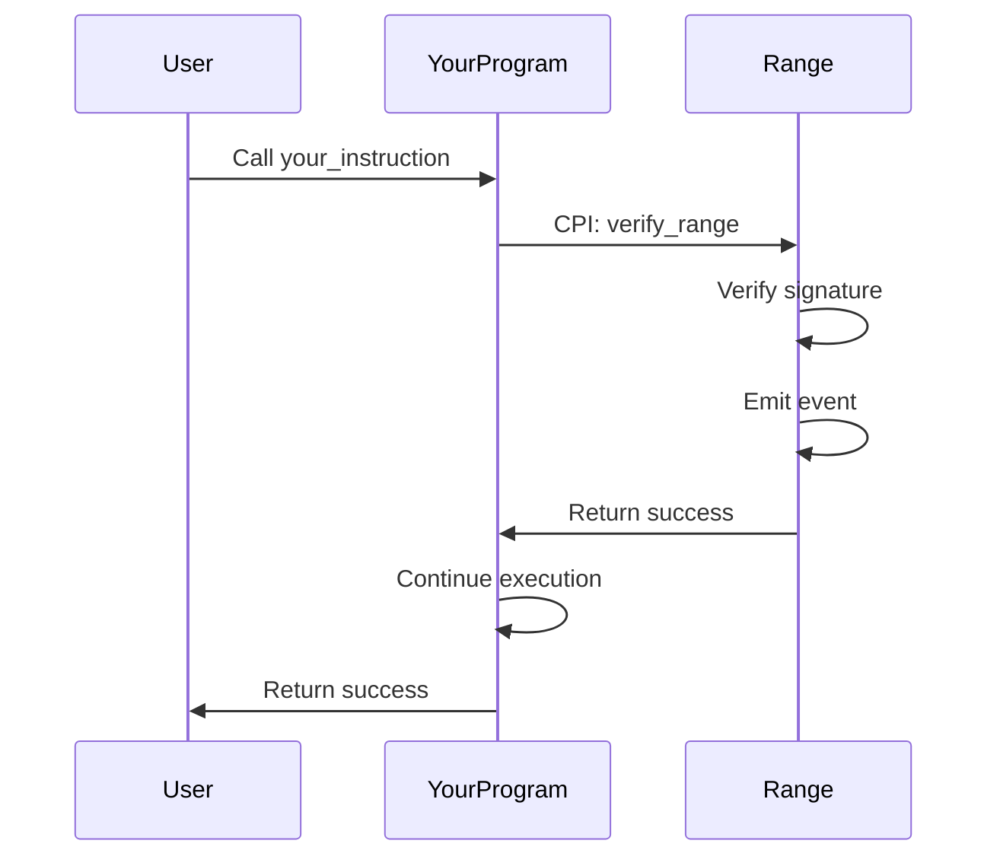

import { Aside } from '@astrojs/starlight/components';

Demonstrates calling Range's `verify_range` instruction from another program via Cross-Program Invocation (CPI). This pattern allows you to add Range verification to your existing program.

## Overview

The CPI program provides an example of how to integrate Range verification into your own Solana program. Instead of having users call Range directly, your program calls Range on their behalf.



## Signature

```rust
pub fn verify_via_range(
    ctx: Context<VerifyViaRange>,
    signature: [u8; 64],
    message: Vec<u8>,
) -> Result<()>
```

## Parameters

| Parameter | Type | Description |
|-----------|------|-------------|
| `signature` | `[u8; 64]` | Ed25519 signature from the backend |
| `message` | `Vec<u8>` | The signed message bytes |

## Accounts

| Account | Type | Description |
|---------|------|-------------|
| `signer` | `Signer` | Transaction signer (must match pubkey in message) |
| `range_program` | `Program` | The Range program |
| `settings` | `AccountInfo` | Range Settings PDA |
| `instructions_sysvar` | `AccountInfo` | Instructions sysvar |

## Usage

### TypeScript (Client)

```typescript
import { PublicKey, Transaction, SYSVAR_INSTRUCTIONS_PUBKEY } from '@solana/web3.js';

// Get Settings PDA
const [settingsPda] = PublicKey.findProgramAddressSync(
  [Buffer.from("settings"), settingsAdmin.toBuffer()],
  RANGE_PROGRAM_ID
);

// Create instruction
const ix = await cpiProgram.methods
  .verifyViaRange(
    Array.from(signature),
    Buffer.from(message)
  )
  .accounts({
    signer: user.publicKey,
    rangeProgram: RANGE_PROGRAM_ID,
    settings: settingsPda,
    instructionsSysvar: SYSVAR_INSTRUCTIONS_PUBKEY,
  })
  .instruction();

const transaction = new Transaction().add(ix);
await sendTransaction(transaction);
```

### Rust (On-chain)

```rust
use anchor_lang::prelude::*;

#[derive(Accounts)]
pub struct VerifyViaRange<'info> {
    pub signer: Signer<'info>,

    /// The Range program
    pub range_program: Program<'info, Range>,

    /// Range Settings account
    /// CHECK: Validated by Range program
    pub settings: AccountInfo<'info>,

    /// Instructions sysvar
    /// CHECK: Validated by Range program
    pub instructions_sysvar: AccountInfo<'info>,
}

pub fn verify_via_range(
    ctx: Context<VerifyViaRange>,
    signature: [u8; 64],
    message: Vec<u8>,
) -> Result<()> {
    // Build CPI accounts
    let cpi_accounts = range::cpi::accounts::VerifyRange {
        signer: ctx.accounts.signer.to_account_info(),
        settings: ctx.accounts.settings.to_account_info(),
        instructions_sysvar: ctx.accounts.instructions_sysvar.to_account_info(),
    };

    let cpi_program = ctx.accounts.range_program.to_account_info();
    let cpi_ctx = CpiContext::new(cpi_program, cpi_accounts);

    // Call Range
    range::cpi::verify_range(cpi_ctx, signature, message)?;

    // Continue with your logic after verification succeeds
    msg!("Verification successful, continuing...");

    Ok(())
}
```

## When to Use This Pattern

Use `verify_via_range` when:

- You want to add Range verification to an existing program
- Your program needs to perform actions before or after verification
- You want to gate your program's functionality behind Range verification

<Aside type="tip">
If you need Range to call **your** program after verification (callback pattern), use `verify_range_with_callback` instead. See [on_verify](/reference/cpi-program/on-verify).
</Aside>

## Integration Example

Adding Range verification to a token transfer:

```rust
pub fn verified_transfer(
    ctx: Context<VerifiedTransfer>,
    signature: [u8; 64],
    message: Vec<u8>,
    amount: u64,
) -> Result<()> {
    // Step 1: Verify via Range
    let cpi_accounts = range::cpi::accounts::VerifyRange {
        signer: ctx.accounts.signer.to_account_info(),
        settings: ctx.accounts.settings.to_account_info(),
        instructions_sysvar: ctx.accounts.instructions_sysvar.to_account_info(),
    };

    let cpi_ctx = CpiContext::new(
        ctx.accounts.range_program.to_account_info(),
        cpi_accounts
    );

    range::cpi::verify_range(cpi_ctx, signature, message)?;

    // Step 2: If verification passed, do the transfer
    let transfer_accounts = Transfer {
        from: ctx.accounts.from_token_account.to_account_info(),
        to: ctx.accounts.to_token_account.to_account_info(),
        authority: ctx.accounts.signer.to_account_info(),
    };

    let cpi_ctx = CpiContext::new(
        ctx.accounts.token_program.to_account_info(),
        transfer_accounts
    );

    token::transfer(cpi_ctx, amount)?;

    msg!("Verified transfer of {} tokens complete", amount);

    Ok(())
}
```

## Error Handling

If Range verification fails, the CPI returns an error and your instruction fails:

```rust
match range::cpi::verify_range(cpi_ctx, signature, message) {
    Ok(_) => {
        // Verification succeeded, continue
    },
    Err(e) => {
        // Verification failed
        // Common errors: CouldntVerifySignature, TimestampOutOfWindow, WrongSigner
        return Err(e);
    }
}
```

## See Also

- [verify_range](/reference/instructions/verify-range) - Direct verification instruction
- [on_verify](/reference/cpi-program/on-verify) - Callback pattern
- [Build CPI Program Guide](/guides/build-cpi-program) - Full integration tutorial
