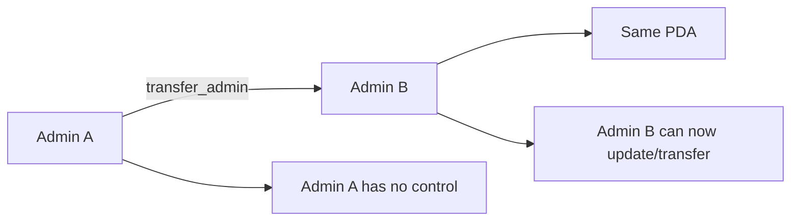

import { Aside } from '@astrojs/starlight/components';

Transfers admin ownership of a Settings account to a new pubkey. Only the current admin can call this instruction.

## Signature

```rust
pub fn transfer_admin(
    ctx: Context<TransferAdmin>,
    new_admin: Pubkey,
) -> Result<()>
```

## Parameters

| Parameter | Type | Description |
|-----------|------|-------------|
| `new_admin` | `Pubkey` | Public key of the new admin |

## Accounts

| Account | Type | Description |
|---------|------|-------------|
| `admin` | `Signer` | Current admin of the Settings account |
| `settings` | `Account<Settings>` | Settings PDA to transfer |

## Usage

### TypeScript

```typescript
import { buildTransferAdminInstruction } from './codama-ts-range-custom';

const instruction = await buildTransferAdminInstruction({
  admin: currentAdminPublicKey,
  newAdmin: newAdminPublicKey,
});

// Sign with current admin and send
const transaction = new Transaction().add(instruction);
await sendTransaction(transaction);
```

### Anchor

```typescript
await program.methods
  .transferAdmin(newAdminPublicKey)
  .accounts({
    admin: currentAdmin.publicKey,
    settings: settingsPda,
  })
  .rpc();
```

## Behavior

1. Verifies caller is the current admin
2. Updates the `admin` field to `new_admin`
3. Current admin immediately loses all control
4. PDA address remains unchanged



<Aside type="caution">
This action is **irreversible** by the original admin. Once transferred, you cannot regain control unless the new admin transfers back.
</Aside>

## Errors

| Error | Cause |
|-------|-------|
| Constraint violation | Caller is not the current admin |
| Account not found | Settings account doesn't exist |

## Use Cases

### Organizational Handoff

Transferring control when changing team ownership:

```typescript
// Current admin transfers to new team lead
const instruction = await buildTransferAdminInstruction({
  admin: currentTeamLead.publicKey,
  newAdmin: newTeamLead.publicKey,
});
```

### Multi-sig Migration

Transferring to a multi-sig wallet for enhanced security:

```typescript
// Transfer to a Squads multi-sig
const instruction = await buildTransferAdminInstruction({
  admin: singleSignerAdmin.publicKey,
  newAdmin: squadsMultisigPda,
});
```

### Emergency Recovery

Setting up a recovery pubkey before deployment:

```typescript
// Create backup admin keypair, store securely offline
const backupAdmin = Keypair.generate();
console.log('Backup admin:', backupAdmin.publicKey.toBase58());
console.log('Store this keypair securely offline!');

// Later, if primary admin is compromised:
const instruction = await buildTransferAdminInstruction({
  admin: primaryAdmin.publicKey,
  newAdmin: backupAdmin.publicKey,
});
```

## Important Notes

### PDA Remains Unchanged

The Settings PDA is derived from the **original** admin pubkey. After transfer:

```typescript
// PDA derivation uses original admin
const [settingsPda] = PublicKey.findProgramAddressSync(
  [Buffer.from("settings"), originalAdmin.toBuffer()], // Original admin!
  RANGE_PROGRAM_ID
);

// But the new admin controls it
// settings.admin === newAdminPublicKey
```

This means existing integrations that reference the PDA continue to work.

### Two-Step Secure Transfer

For high-value transfers, consider a two-step process:

```typescript
// Step 1: Transfer to intermediate (verify new admin has access)
await buildTransferAdminInstruction({
  admin: currentAdmin.publicKey,
  newAdmin: intermediateAdmin.publicKey, // New admin's hot wallet
});

// Step 2: New admin transfers to their secure wallet
await buildTransferAdminInstruction({
  admin: intermediateAdmin.publicKey,
  newAdmin: secureMultisig.publicKey,
});
```

## See Also

- [Settings Account](/reference/settings-account) - Understanding Settings
- [update_settings](/reference/instructions/update-settings) - Modifying settings
- [Security](/security) - Security best practices
