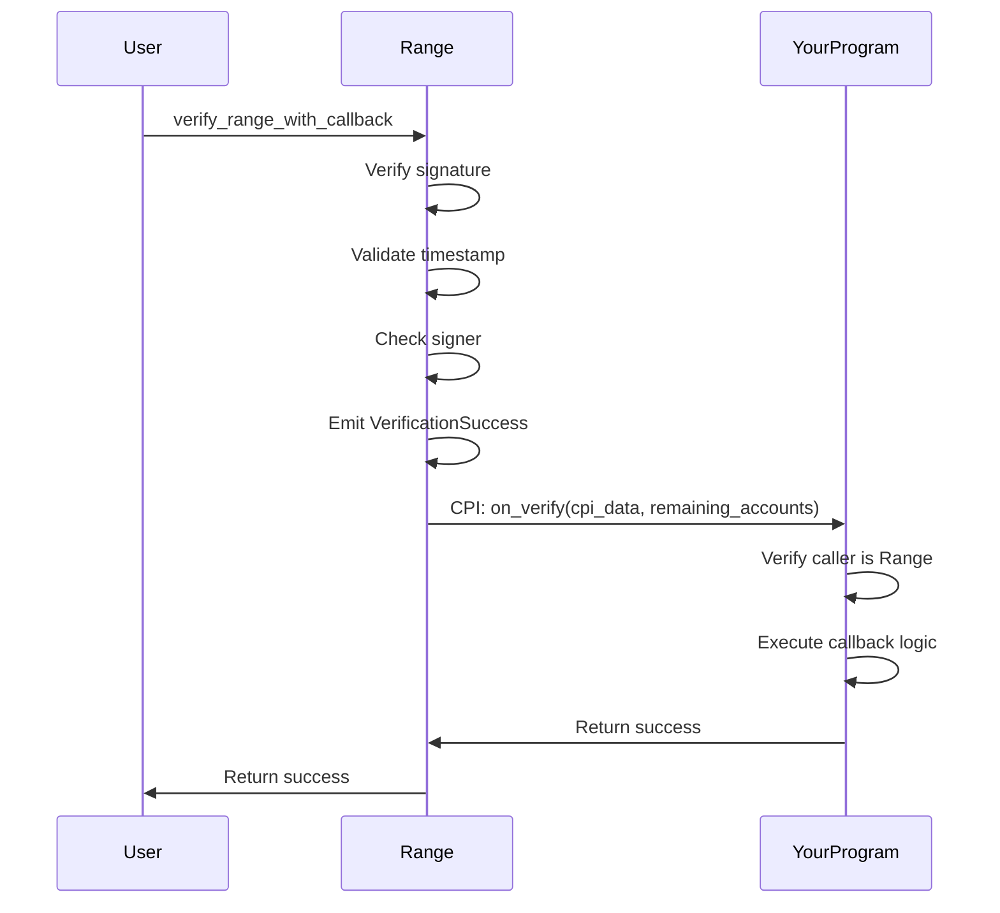

import { Aside } from '@astrojs/starlight/components';

Performs the same verification as `verify_range`, then triggers a CPI callback to a target program. The verification and callback are atomic - if the callback fails, the entire transaction reverts.

## Signature

```rust
pub fn verify_range_with_callback(
    ctx: Context<VerifyRangeWithCallback>,
    signature: [u8; 64],
    message: Vec<u8>,
    cpi_data: Vec<u8>,
) -> Result<()>
```

## Parameters

| Parameter | Type | Description |
|-----------|------|-------------|
| `signature` | `[u8; 64]` | Ed25519 signature from the backend |
| `message` | `Vec<u8>` | The signed message bytes |
| `cpi_data` | `Vec<u8>` | Arbitrary data passed to the callback |

## Accounts

| Account | Type | Description |
|---------|------|-------------|
| `signer` | `Signer` | Transaction signer (must match pubkey in message) |
| `settings` | `Account<Settings>` | Settings PDA containing verification config |
| `target_program` | `AccountInfo` | Program to CPI into after verification |
| `instructions_sysvar` | `AccountInfo` | Instructions sysvar |
| `remaining_accounts` | `Vec<AccountInfo>` | Additional accounts passed to callback |

## Usage

### TypeScript

```typescript
import { buildVerifyRangeWithCallbackInstruction } from './codama-ts-range-custom';
import { SYSVAR_INSTRUCTIONS_PUBKEY } from '@solana/web3.js';

const instruction = await buildVerifyRangeWithCallbackInstruction({
  signer: userPublicKey,
  admin: settingsAdminPublicKey,
  targetProgram: yourProgramId,
  signature: new Uint8Array(signatureBytes),
  message: new Uint8Array(messageBytes),
  cpiData: new Uint8Array([1, 2, 3, 4]), // Your custom data
  remainingAccounts: [
    { pubkey: userPublicKey, isSigner: true, isWritable: false },
    { pubkey: SYSVAR_INSTRUCTIONS_PUBKEY, isSigner: false, isWritable: false },
    // Add any other accounts your callback needs
  ],
});

const transaction = new Transaction().add(instruction);
await sendTransaction(transaction);
```

### Anchor

```typescript
await program.methods
  .verifyRangeWithCallback(
    Array.from(signature),
    Buffer.from(message),
    Buffer.from([1, 2, 3, 4]) // cpi_data
  )
  .accounts({
    signer: user.publicKey,
    settings: settingsPda,
    targetProgram: yourProgramId,
    instructionsSysvar: SYSVAR_INSTRUCTIONS_PUBKEY,
  })
  .remainingAccounts([
    { pubkey: user.publicKey, isSigner: true, isWritable: false },
    { pubkey: SYSVAR_INSTRUCTIONS_PUBKEY, isSigner: false, isWritable: false },
  ])
  .rpc();
```

## Flow



<Aside type="caution">
If the callback fails, the **entire transaction reverts**, including the verification. This ensures you can't have a "verified" state without the callback completing.
</Aside>

## Callback Requirements

Your target program must implement an `on_verify` instruction that:

1. **Accepts the expected accounts**: signer + instructions_sysvar + your accounts
2. **Verifies the caller is Range**: Check instruction sysvar to ensure CPI came from Range
3. **Processes `cpi_data`**: Handle the arbitrary data you passed

Example callback implementation:

```rust
pub fn on_verify(ctx: Context<OnVerify>, cpi_data: Vec<u8>) -> Result<()> {
    // 1. Verify caller is Range (CPI-only enforcement)
    let ix_sysvar = &ctx.accounts.instructions_sysvar;
    let current_ix = get_instruction_relative(0, ix_sysvar)?;

    require!(
        current_ix.program_id == RANGE_PROGRAM_ID,
        YourError::CpiOnly
    );

    // 2. Process your callback logic
    msg!("Received cpi_data: {:?}", cpi_data);

    // 3. Do whatever you need after verification
    // - Update state
    // - Transfer tokens
    // - Emit events
    // etc.

    Ok(())
}
```

## Use Cases

### Gated Token Transfer

Only allow transfers after Range verification:

```typescript
const cpiData = new TextEncoder().encode(JSON.stringify({
  action: 'transfer',
  amount: 1000,
  recipient: recipientPubkey.toBase58(),
}));

const instruction = await buildVerifyRangeWithCallbackInstruction({
  signer: userPublicKey,
  admin: settingsAdminPublicKey,
  targetProgram: tokenGatingProgram,
  signature,
  message,
  cpiData: new Uint8Array(cpiData),
  remainingAccounts: [
    { pubkey: userPublicKey, isSigner: true, isWritable: false },
    { pubkey: SYSVAR_INSTRUCTIONS_PUBKEY, isSigner: false, isWritable: false },
    { pubkey: userTokenAccount, isSigner: false, isWritable: true },
    { pubkey: recipientTokenAccount, isSigner: false, isWritable: true },
    { pubkey: TOKEN_PROGRAM_ID, isSigner: false, isWritable: false },
  ],
});
```

### KYC-Gated Actions

Only allow certain actions for verified users:

```typescript
const cpiData = new TextEncoder().encode(JSON.stringify({
  kycLevel: 'verified',
  action: 'create_order',
  orderId: '12345',
}));
```

### Rate-Limited Operations

Backend controls rate limiting, callback executes the operation:

```typescript
const cpiData = new TextEncoder().encode(JSON.stringify({
  rateLimit: {
    windowStart: timestamp,
    requestsRemaining: 5,
  },
  operation: 'api_call',
}));
```

## Errors

In addition to `verify_range` errors, you may see:

| Error | Cause |
|-------|-------|
| CPI callback failed | Your `on_verify` returned an error |
| Invalid program | `target_program` is not executable |
| Missing accounts | `remaining_accounts` missing required accounts |

## remaining_accounts

The `remaining_accounts` are passed directly to your callback. Order matters:

```typescript
remainingAccounts: [
  // Index 0: signer (required by most callbacks)
  { pubkey: userPublicKey, isSigner: true, isWritable: false },
  // Index 1: instructions sysvar (for CPI verification)
  { pubkey: SYSVAR_INSTRUCTIONS_PUBKEY, isSigner: false, isWritable: false },
  // Index 2+: your custom accounts
  { pubkey: customAccount1, isSigner: false, isWritable: true },
  { pubkey: customAccount2, isSigner: false, isWritable: false },
],
```

In your callback, access them by index:

```rust
let signer = &ctx.remaining_accounts[0];
let instructions_sysvar = &ctx.remaining_accounts[1];
let custom_account = &ctx.remaining_accounts[2];
```

## See Also

- [verify_range](/reference/instructions/verify-range) - Simple verification without callback
- [CPI Callbacks Guide](/guides/cpi-callbacks) - Detailed callback implementation guide
- [on_verify](/reference/cpi-program/on-verify) - Callback instruction reference
