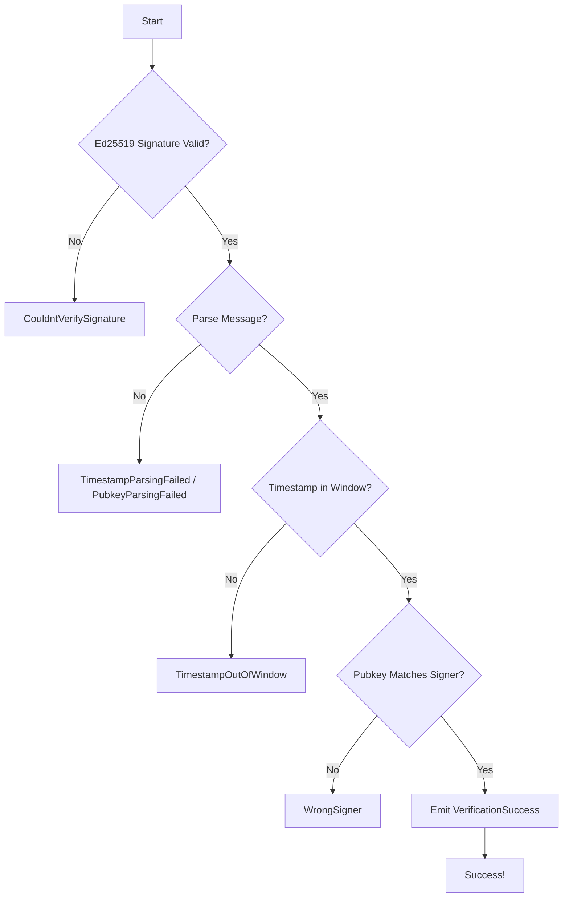

import { Aside } from '@astrojs/starlight/components';

The core verification instruction. Verifies that a message was signed by the trusted backend and that the signature is valid for the transaction signer.

## Signature

```rust
pub fn verify_range(
    ctx: Context<VerifyRange>,
    signature: [u8; 64],
    message: Vec<u8>,
) -> Result<()>
```

## Parameters

| Parameter | Type | Description |
|-----------|------|-------------|
| `signature` | `[u8; 64]` | Ed25519 signature from the backend |
| `message` | `Vec<u8>` | The signed message bytes |

## Accounts

| Account | Type | Description |
|---------|------|-------------|
| `signer` | `Signer` | Transaction signer (must match pubkey in message) |
| `settings` | `Account<Settings>` | Settings PDA containing verification config |
| `instructions_sysvar` | `AccountInfo` | Instructions sysvar for Ed25519 verification |

## Message Format

The message must follow this format:

```
{timestamp}_{pubkey}
```

- `timestamp`: Unix timestamp (seconds) when the backend signed
- `pubkey`: Base58-encoded public key of the user

Example: `1704067200_7xKXtg2CW87d97TXJSDpbD5jBkheTqA83TZRuJosgAsU`

## Usage

### TypeScript

```typescript
import { buildVerifyRangeInstruction } from './codama-ts-range-custom';

const instruction = await buildVerifyRangeInstruction({
  signer: userPublicKey,
  admin: settingsAdminPublicKey,
  signature: new Uint8Array(signatureBytes),
  message: new Uint8Array(messageBytes),
});

const transaction = new Transaction().add(instruction);
await sendTransaction(transaction);
```

### Anchor

```typescript
await program.methods
  .verifyRange(
    Array.from(signature),
    Buffer.from(message)
  )
  .accounts({
    signer: user.publicKey,
    settings: settingsPda,
    instructionsSysvar: SYSVAR_INSTRUCTIONS_PUBKEY,
  })
  .rpc();
```

## Verification Steps

The instruction performs these checks in order:



1. **Signature Verification**: Verify Ed25519 signature against `settings.range_signer`
2. **Message Parsing**: Extract timestamp and pubkey from message
3. **Timestamp Validation**: Check timestamp is within `settings.window_size`
4. **Signer Validation**: Verify message pubkey matches transaction signer

## Errors

| Error | Code | Cause |
|-------|------|-------|
| `CouldntVerifySignature` | 6005 | Signature doesn't match range_signer |
| `TimestampParsingFailed` | 6000 | Invalid timestamp in message |
| `PubkeyParsingFailed` | 6001 | Invalid pubkey in message |
| `WrongMessageSplitLength` | 6002 | Message format incorrect |
| `WrongSigner` | 6003 | Message pubkey doesn't match tx signer |
| `TimestampOutOfWindow` | 6004 | Signature expired or from future |

## Complete Example

```typescript
import { Connection, Keypair, Transaction } from '@solana/web3.js';
import { buildVerifyRangeInstruction } from './codama-ts-range-custom';
import nacl from 'tweetnacl';

async function verifySignature(
  connection: Connection,
  user: Keypair,
  settingsAdmin: PublicKey,
  rangeSignerKeypair: Keypair // Backend's keypair
) {
  // 1. Create the message (normally done on backend)
  const timestamp = Math.floor(Date.now() / 1000);
  const message = `${timestamp}_${user.publicKey.toBase58()}`;
  const messageBytes = Buffer.from(message);

  // 2. Sign with backend key (normally done on backend)
  const signature = nacl.sign.detached(
    messageBytes,
    rangeSignerKeypair.secretKey
  );

  // 3. Create verification instruction
  const instruction = await buildVerifyRangeInstruction({
    signer: user.publicKey,
    admin: settingsAdmin,
    signature: new Uint8Array(signature),
    message: new Uint8Array(messageBytes),
  });

  // 4. Send transaction
  const transaction = new Transaction().add(instruction);
  transaction.feePayer = user.publicKey;
  transaction.recentBlockhash = (await connection.getLatestBlockhash()).blockhash;
  transaction.sign(user);

  const txSignature = await connection.sendRawTransaction(transaction.serialize());
  console.log('Verification successful:', txSignature);
}
```

## Events

On success, emits a `VerificationSuccess` event:

```typescript
{
  signer: Pubkey,
  timestamp: i64,
  signature: [u8; 64],
  message: Vec<u8>,
  clock_slot: u64,
  clock_timestamp: i64,
  settings_admin: Pubkey,
}
```

See [Events](/reference/events) for details on listening to events.

<Aside type="tip">
Use `verify_range` when you just need verification. If you need to trigger additional logic after verification, use [verify_range_with_callback](/reference/instructions/verify-range-with-callback) instead.
</Aside>

## See Also

- [verify_range_with_callback](/reference/instructions/verify-range-with-callback) - Verification with CPI callback
- [Quick Start](/quick-start) - End-to-end example
- [Errors](/reference/errors) - Error handling guide
