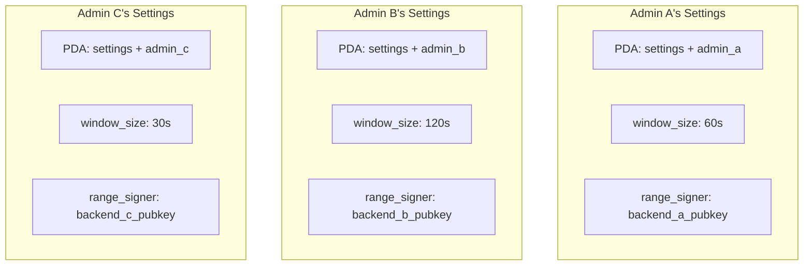
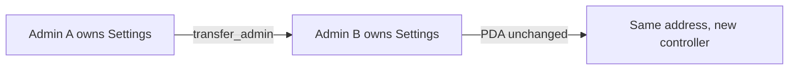

import { Aside } from '@astrojs/starlight/components';

The Settings account stores configuration for Range verification. Each admin creates their own Settings account, enabling multi-tenant deployments.

## Multi-Tenant Model

Range uses a **multi-tenant architecture** where each admin has their own isolated Settings:



**Benefits:**
- Each project/admin has independent configuration
- No shared state or conflicts between tenants
- Different `window_size` values for different use cases
- Separate `range_signer` keys for isolated backends

## Account Structure

```rust
pub struct Settings {
    pub bump: u8,
    pub admin: Pubkey,
    pub window_size: u64,
    pub range_signer: Pubkey,
}
```

| Field | Type | Description |
|-------|------|-------------|
| `bump` | `u8` | PDA bump seed for deterministic derivation |
| `admin` | `Pubkey` | Current owner who can modify settings |
| `window_size` | `u64` | Time window (seconds) for timestamp validation |
| `range_signer` | `Pubkey` | Public key of the trusted backend signer |

## PDA Derivation

Settings accounts are Program Derived Addresses (PDAs) derived from the admin's public key:

```typescript
const [settingsPda, bump] = PublicKey.findProgramAddressSync(
  [Buffer.from("settings"), adminPubkey.toBuffer()],
  RANGE_PROGRAM_ID
);
```

**Seeds:** `["settings", admin_pubkey]`

<Aside type="note">
Since the PDA is derived from the admin pubkey, each admin can only have **one** Settings account. This simplifies management and prevents confusion.
</Aside>

## Creating Settings

Any user can create a Settings account by calling `initialize_settings`:

```typescript
import { buildInitializeSettingsInstruction } from './codama-ts-range-custom';

const instruction = await buildInitializeSettingsInstruction({
  admin: walletPublicKey,         // You become the admin
  rangeSigner: backendPublicKey,  // Your backend's signing key
  windowSize: 60n,                // 60 second validity window
});
```

Once created, you are the admin of this Settings account.

## Updating Settings

Only the current admin can update `window_size` and `range_signer`:

```typescript
import { buildUpdateSettingsInstruction } from './codama-ts-range-custom';

const instruction = await buildUpdateSettingsInstruction({
  admin: walletPublicKey,
  windowSize: 120n,                    // Optional: new window size
  rangeSigner: newBackendPublicKey,    // Optional: new trusted signer
});
```

<Aside type="tip">
You can update one field without changing the other. Pass `null` or omit the field you don't want to change.
</Aside>

## Transferring Admin

Admin ownership can be transferred to another pubkey:

```typescript
import { buildTransferAdminInstruction } from './codama-ts-range-custom';

const instruction = await buildTransferAdminInstruction({
  admin: currentAdminPublicKey,
  newAdmin: newAdminPublicKey,
});
```

**Important:**
- Only the current admin can transfer ownership
- The PDA address stays the same (derived from original admin)
- The `admin` field in the account changes to the new admin
- Old admin immediately loses all control



## Choosing window_size

The `window_size` determines how long a backend signature remains valid:

| Value | Use Case | Trade-offs |
|-------|----------|------------|
| 30s | High-security, fast networks | Less tolerance for latency |
| 60s | **Recommended default** | Good balance of security and usability |
| 120s | Slower networks, batch operations | Wider replay attack window |
| 300s+ | Very slow networks, offline signing | Higher risk, not recommended |

<Aside type="caution">
Larger `window_size` values increase the replay attack window. A malicious actor could reuse a valid signature within this window. Keep it as small as practical for your use case.
</Aside>

## Using Settings in Verification

When calling `verify_range`, you must specify which Settings to use:

```typescript
const instruction = await buildVerifyRangeInstruction({
  signer: userPublicKey,
  admin: settingsAdminPubkey,   // Points to the Settings to use
  signature: signature,
  message: message,
});
```

The `admin` parameter determines which Settings account's `range_signer` and `window_size` are used for verification.

## Best Practices

1. **Secure your admin keypair** - It controls your Settings
2. **Rotate `range_signer` periodically** - Update via `update_settings` if your backend key is compromised
3. **Use smallest practical `window_size`** - Minimize replay attack window
4. **Monitor Settings changes** - Log `update_settings` and `transfer_admin` events
5. **Test on devnet first** - Verify your configuration before mainnet
