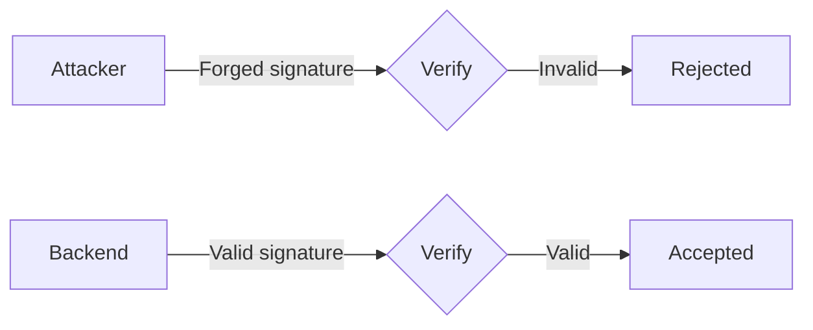
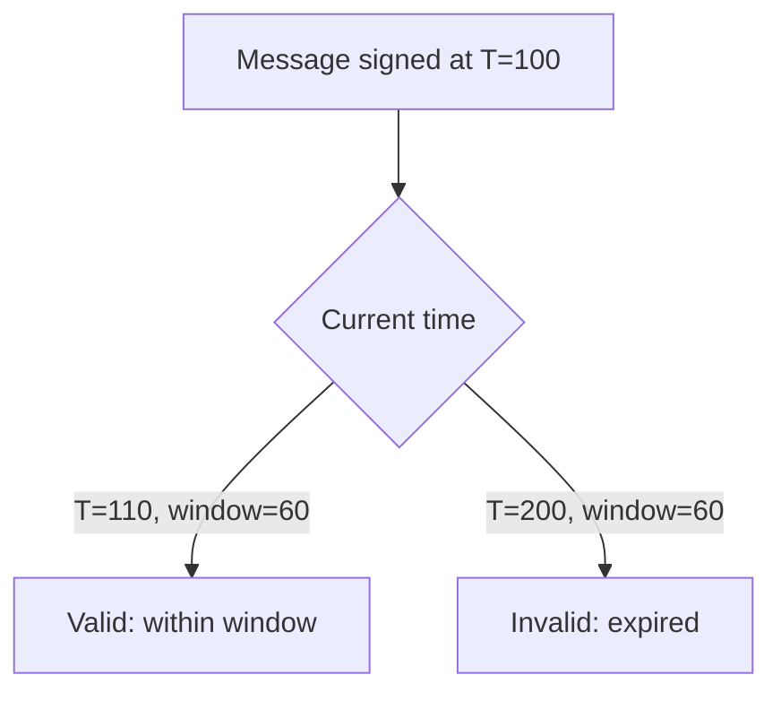

import { Aside } from '@astrojs/starlight/components';

Range is designed with security as a primary concern. Understanding the threat model and following best practices ensures your integration remains secure.

## Threat Model

### What Range Protects Against

| Threat | How Range Mitigates |
|--------|---------------------|
| **Forged authorizations** | Ed25519 signature verification against trusted `range_signer` |
| **Replay attacks** | Timestamp validation within configurable `window_size` |
| **Signature theft** | Pubkey in message must match transaction signer |
| **Message tampering** | Any modification invalidates the Ed25519 signature |

### What You Must Protect

| Threat | Your Responsibility |
|--------|---------------------|
| **range_signer key compromise** | Secure key storage, rotation procedures |
| **Admin key compromise** | Secure admin keypair, consider multi-sig |
| **Backend compromise** | Secure backend infrastructure |
| **Compliance bypass** | Proper compliance checks before signing |

## Security Properties

### Authenticity

Only the holder of the `range_signer` private key can create valid signatures:



The Ed25519 signature algorithm provides 128-bit security level.

### Freshness

Timestamps prevent reuse of old signatures:



<Aside type="caution">
Choose `window_size` carefully. Smaller windows are more secure but less tolerant of network latency.
</Aside>

### Binding

Signatures cannot be used by different users:

```
Message: "1704067200_Alice_pubkey"
         └─────────────────────┘
                   │
                   ▼
         Must match transaction signer
```

If Bob tries to use Alice's signature, verification fails with `WrongSigner`.

## Best Practices

### 1. Secure range_signer Key

The `range_signer` keypair is your most critical secret:

- **Never** expose the private key in client code
- Store in secure key management (AWS KMS, HashiCorp Vault, etc.)
- Use separate keys for devnet and mainnet
- Implement key rotation procedures

```typescript
// GOOD: Load from secure secret manager
const privateKey = await secretManager.getSecret('RANGE_SIGNER_KEY');

// BAD: Hardcoded or in environment variable
const privateKey = process.env.RANGE_SIGNER_KEY; // Better than hardcoded, but consider KMS
```

### 2. Choose Appropriate window_size

| Environment | Recommended window_size | Rationale |
|-------------|------------------------|-----------|
| Production | 30-60 seconds | Balance security and usability |
| Testing | 60-120 seconds | Account for slower test networks |
| High-security | 15-30 seconds | Minimize replay window |

```typescript
// Production settings
const windowSize = 60n; // 60 seconds

// Monitor for TimestampOutOfWindow errors and adjust if needed
```

### 3. Implement Key Rotation

Plan for key rotation before you need it:

```typescript
async function rotateRangeSigner(
  admin: Keypair,
  newRangeSigner: PublicKey,
  connection: Connection
) {
  // 1. Update Settings with new signer
  const instruction = await buildUpdateSettingsInstruction({
    admin: admin.publicKey,
    rangeSigner: newRangeSigner,
  });

  await sendTransaction(new Transaction().add(instruction));

  // 2. Immediately update backend to use new key
  await updateBackendSignerKey(newRangeSigner);

  // 3. Log rotation event
  console.log(`Rotated range_signer to ${newRangeSigner.toBase58()}`);
}
```

### 4. Protect Admin Key

The admin key controls Settings configuration:

- Use hardware wallet for admin operations
- Consider multi-sig (Squads, etc.) for production
- Never use admin key for routine operations

```typescript
// Transfer admin to multi-sig after initial setup
await buildTransferAdminInstruction({
  admin: initialAdmin.publicKey,
  newAdmin: squadsMultisigPda,
});
```

### 5. Validate Before Signing

Backend should validate all requests before signing:

```typescript
app.post('/api/verify', async (req, res) => {
  const { pubkey, action, amount } = req.body;

  // 1. Validate pubkey format
  try {
    new PublicKey(pubkey);
  } catch {
    return res.status(400).json({ error: 'Invalid pubkey' });
  }

  // 2. Check compliance
  const isCompliant = await checkCompliance(pubkey);
  if (!isCompliant) {
    return res.status(403).json({ error: 'Compliance check failed' });
  }

  // 3. Check rate limits
  if (!checkRateLimit(pubkey)) {
    return res.status(429).json({ error: 'Rate limited' });
  }

  // 4. Validate action-specific rules
  if (action === 'withdraw' && amount > MAX_WITHDRAW) {
    return res.status(400).json({ error: 'Amount exceeds limit' });
  }

  // Only sign after all checks pass
  const signature = sign(message, rangeSignerKeypair);
  // ...
});
```

### 6. Monitor and Alert

Implement monitoring for security events:

```typescript
// Monitor for suspicious patterns
const suspiciousPatterns = {
  highFrequencyRequests: (pubkey: string) => {
    // Alert if > 100 requests in 1 minute
  },
  multipleFailures: (pubkey: string) => {
    // Alert if > 10 verification failures
  },
  unusualTimestamps: (timestamp: number) => {
    // Alert if timestamp is significantly off
  },
};

// Alert on Settings changes
program.addEventListener('VerificationSuccess', (event) => {
  // Log all verifications for audit
});
```

## Common Vulnerabilities

### 1. Timestamp Manipulation

**Risk**: Clock drift between backend and Solana.

**Mitigation**:
- Use NTP to synchronize server clocks
- Add small buffer to window_size for network latency
- Monitor `TimestampOutOfWindow` error rates

### 2. Signature Replay Within Window

**Risk**: Same signature used multiple times within `window_size`.

**Mitigation**:
- Keep `window_size` small
- For high-value operations, use on-chain nonces
- Track used signatures in backend (if needed)

### 3. Callback Bypass (CPI Programs)

**Risk**: Direct calls to `on_verify` bypassing Range.

**Mitigation**:
- Always verify CPI caller is Range program
- Use instruction sysvar to check calling program

```rust
// CRITICAL: Always include this check
require!(
    calling_ix.program_id == RANGE_PROGRAM_ID,
    ErrorCode::CpiOnly
);
```

### 4. Message Format Injection

**Risk**: Malicious data in extended message fields.

**Mitigation**:
- Validate all parsed fields on-chain
- Use fixed message format
- Limit field lengths

## Incident Response

### Key Compromise Procedure

If `range_signer` is compromised:

1. **Immediately** rotate to new key via `update_settings`
2. Update backend with new signing key
3. Audit recent transactions for suspicious activity
4. Notify affected users if necessary

### Admin Compromise Procedure

If admin key is compromised:

1. If possible, `transfer_admin` to secure backup key
2. If not possible, contact users to migrate to new Settings
3. Audit Settings changes

## Security Checklist

Before going to production:

- [ ] `range_signer` stored in secure key management
- [ ] Admin key secured (hardware wallet or multi-sig)
- [ ] `window_size` appropriate for use case
- [ ] Backend validates all requests before signing
- [ ] Rate limiting implemented
- [ ] Compliance checks in place
- [ ] CPI programs verify Range caller
- [ ] Monitoring and alerting configured
- [ ] Key rotation procedure documented
- [ ] Incident response plan in place

## See Also

- [Settings Account](/reference/settings-account) - Managing configuration
- [Errors](/reference/errors) - Understanding error codes
- [Rate Limiting](/guides/rate-limiting) - Protecting your backend
